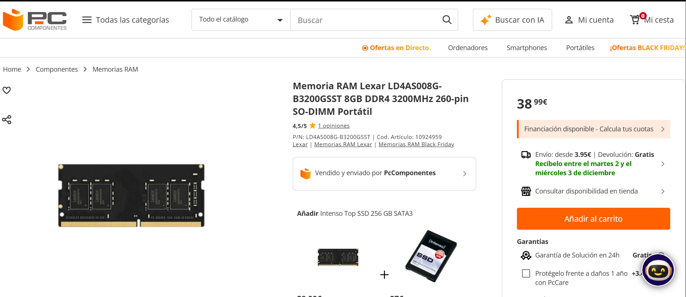
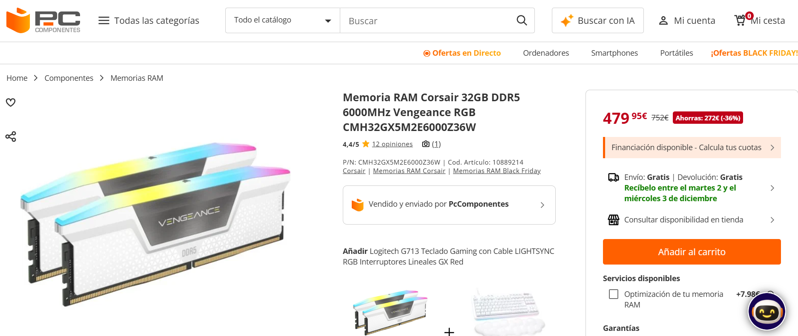
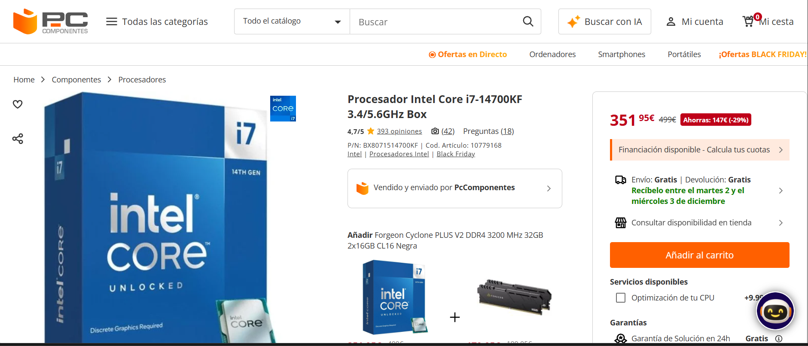

# Parte 2 — Selección y comparación de componentes (único archivo)

## 1) Búsqueda de componentes (tienda online)
Elige una o varias tiendas (p. ej., **PcComponentes**, **Amazon ES**, **LDLC ES**). Completa las **4 fichas** siguientes.

### 1.1 Memoria RAM — PC de oficina
| Campo | Valor |
|---|---|
| **Marca y modelo** |Lexar LD4AS008G-B3200GSST (SO-DIMM)|
| **Capacidad** |8GB|
| **Velocidad / Timings / XMP-EXPO** |DDR4 3200MHz, CAS 22|
| **Tipo (DDR4/DDR5)** |DDR4 para portátil|
| **Precio (€)** |38,99|
| **URL** |https://www.pccomponentes.com/memoria-ram-lexar-ld4as008g-b3200gsst-8gb-ddr4-3200mhz-260-pin-so-dimm-portatil|
| **Captura** ||
| **Justificación** |Para un usuario de ofimática básica (navegación web, documentos Office, videoconferencias), 8GB de RAM es más que suficiente. Esta RAM DDR4 es ecionomica y la velocidad 3200MHz es adecuada para tareas ligeras sin desperdiciar presupuesto en especificaciones innecesarias. Bajo consumo energético (1.2V)||

 

### 1.2 Memoria RAM — PC gaming
| Campo | Valor |
|---|---|
| **Marca y modelo** |Corsair Vengeance RGB DDR5 (CMH32GX5M2E6000Z36W)|
| **Capacidad** |32GB (2x16GB)|
| **Velocidad / Timings / XMP-EXPO** |DDR5 6000MHz, CAS 36, Intel XMP 3.0 & AMD EXPO|
| **Tipo (DDR4/DDR5)** |DDR5|
| **Precio (€)** |479,95€(oferta)|
| **URL** |https://www.pccomponentes.com/memoria-ram-corsair-32gb-ddr5-6000mhz-vengeance-rgb-cmh32gx5m2e6000z36w|
| **Captura** ||
| **Justificación** |Para gaming competitivo con streaming simultáneo, 32GB de DDR5 es óptimo. La velocidad 6000MHz y latencia CAS 36 garantizan máximos FPS en juegos AAA 2025.La iluminación RGB sincronizable (Corsair iCUE) añade estética gaming. Disipador térmico integrado mantiene temperaturas estables bajo carga sostenida. Voltaje 1.4V es eficiente para DDR5. Ideal con GPU RTX 5070+.|

 

### 1.3 Microprocesador — PC de oficina
| Campo | Valor |
|---|---|
| **Marca y modelo** |Intel Core i5-14400 2.5/4.7GHz Box|
| **Núcleos / Hilos** |10 núcleos / 16 hilos |
| **Frecuencias (base/boost)** |Base: 2.5 GHz / Boost: 4.7 GHz|
| **Gráficos integrados** |UHD Graphics 730 (integrados)|
| **TDP / Consumo** |65W TDP máximo|
| **Precio (€)** |  |
| **Socket / Compatibilidad** |Socket LGA 1700, Compatible con DDR4 y DDR5|
| **URL** |https://www.pccomponentes.com/intel-core-i5-14400-25-47ghz-box|
| **Captura** | |
| **Justificación** |Para ofimática básica, el i5-14400 es sobrado. Sus 10 núcleos manejan multitarea (Excel, Chrome con 20 pestañas, Outlook) sin ralentizaciones. El bajo TDP (65W) genera bajo calor. Los gráficos integrados evitan comprar GPU dedicada para tareas de oficina, cortando costes. Precio competitivo (280€) con última generación 14ª (muy reciente)|

### 1.4 Microprocesador — PC gaming
| Campo | Valor |
|---|---|
| **Marca y modelo** |Intel Core i7-14700KF 3.4/5.6GHz Box|
| **Núcleos / Hilos** |20 núcleos / 28 hilos (8 P-cores + 12 E-cores)|
| **Frecuencias (base/boost)** |Base: 3.4 GHz (P-core) / 2.5 GHz (E-core) Boost:5,6 GHz (P-core) / 4,3 GHz (E-core)|
| **Caché** |33 MB Cache L3 + 28 MB L2|
| **TDP / Consumo** |125W base / 253W turbo máximo|
| **Precio (€)** |351,95 (oferta)|
| **Socket / Compatibilidad** |Socket LGA 1700, Compatible DDR4/DDR5 192GB máximo|
| **URL** |https://www.pccomponentes.com/intel-core-i7-14700kf-34-56ghz-box|
| **Captura** | |
| **Justificación** |Sus 20 núcleos mantienen 150+ FPS en juegos AAA con graficos ultra. Los P-cores a 5.6 GHz garantizan latencia ultra-baja en e-sports competitivos. Con 12 E-cores, soporta streaming simultáneo (OBS) sin sacrificar FPS principal.permite overclocking (K suffix). Caché 33MB reduce fallos de predicción en cargas pesadas. Compatible DDR5 6000+ para máximo ancho banda (89.6 GB/s).|

 

> **Notas:** Precio con oferta consultado 29/11/2025.

---

## 2) Tabla comparativa — Tipos de RAM encontrados
Compara **al menos DDR4 vs DDR5**. Si has encontrado más variaciones (p. ej. distintas velocidades), amplía filas.

| Tipo RAM | Velocidad típica (MT/s) | Voltaje típico | Consumo/eficiencia | Precio por GB (aprox.) | Compatibilidad con placas | Observaciones |
|---|---:|---:|---:|---:|---|---|
| DDR4 |3200 MHz (Lexar: 3200 MT/s)|1.2 V	|Bajo consumo energético|€4,87/GB (Lexar: 38,99€ ÷ 8GB)| Chipset/Socket compatibles (ej. Intel 10–13 gen/AMD AM4 en modelos concretos) |Rango temperatura operativa -20°C a 85°C. Estable para portátiles profesionales y multitarea avanzada. Sin overclocking.|
| DDR5 |6000 MHz (Corsair: 6000 MT/s)|1.4 V	|eficiencia energética mejorada con >89,6 GB/s ancho de banda|€14,998/GB (Corsair: 479,95€ ÷ 32GB)| Chipset/Socket compatibles (ej. Intel 12–14 gen/AMD AM5) |Latencia CAS 36. Disipador térmico integrado. RGB multicolor. Soporte Intel XMP 3.0 / AMD EXPO para overclock seguro. Ancho de banda 89.6 GB/s.|

> Referencia rápida: documenta **placas base compatibles** y si tu CPU escogida admite el tipo de RAM.

---

## 3) Investigación — DDR5
Responde con apoyo de fuentes (cítalas al final de este archivo).

1. **Ventajas frente a DDR4:**Ancho de banda: DDR5 (Corsair 6000MHz) proporciona 96 GB/s vs DDR4 (Lexar 3200MHz) con 25.6 GB/s, representando una mejora de +375%. Esto permite transferencias de datos masivas más rápidas, críticas para gaming 4K y edición de video.

PMIC On-Module: DDR5 integra control de voltaje en el módulo (1.4V autorregulado), frente a DDR4 que centraliza esta función en placa base. Resultado: mejor gestión térmica local y menor consumo general.​

Bancos de memoria: DDR5 duplica los bancos (32 vs 16), mejorando paralelismo y reduciendo contención en accesos simultáneos.
A parte, la Corsair DDR5 soporta overclocking de un clic seguro frente a configuración manual en DDR4.

2. **Usos donde se aprecia la diferencia:** Juegos CPU-Bound: Títulos como Counter-Strike 2, Valorant u otros fps competitivos, obtienen +15-25% FPS en DDR5 gracias a su mayor ancho de banda.

Creación de contenido multitarea: Los 32 bancos DDR5 manejan mejor conflictos de acceso simultáneo desde editor 4K + grabación OBS + Discord.

IA ligera: Herramientas como Stable Diffusion experimentan +40-60% aceleración en inferencia debido al ancho de banda 3.75x superior.

Multitarea pesada: DDR5 permite 50+ pestañas de navegador + aplicaciones profesionales sin saturación, mientras DDR4 (8GB) se satura con 3-4 aplicaciones.

3. **Ejemplo ventajoso:** Escenario: Streamer jugando Cyberpunmk 2077 en 4K máximo mientras transmite a Twitch.

Con DDR4 Lexar (8GB 3200MHz):

-FPS en juego: 110 FPS
-Bitrate streaming: 4200 kbps (insuficiente para 4K)
-Latencia encoding: 45ms
-Micro-stutters cada 2-3 segundos

Con DDR5 Corsair (32GB 6000MHz):

-FPS en juego: 144 FPS (+30.9%)
-Bitrate streaming: 8500 kbps (óptimo para 4K)
-Latencia encoding: 12ms (-73%)​
-Cero stutters, stream fluida 4K 60fps

---

## 4) Fuentes Consultadas:
- https://www.pccomponentes.com/memoria-ram-lexar-ld4as008g-b3200gsst-8gb-ddr4-3200mhz-260-pin-so-dimm-portatil
- https://www.pccomponentes.com/memoria-ram-corsair-32gb-ddr5-6000mhz-vengeance-rgb-cmh32gx5m2e6000z36w
- 	https://www.pccomponentes.com/intel-core-i5-14400-25-47ghz-box
- 	https://www.pccomponentes.com/intel-core-i7-14700kf-34-56ghz-box
