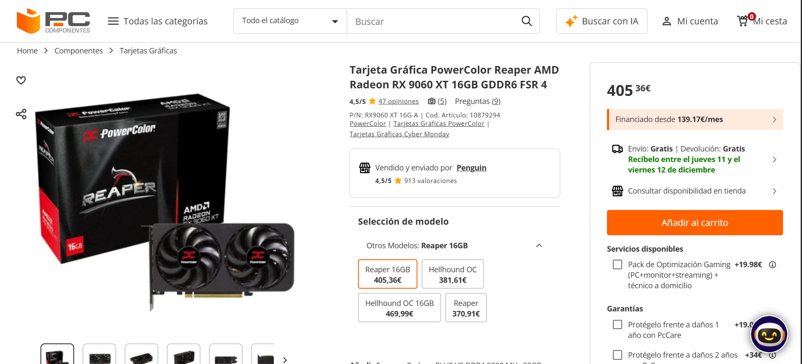
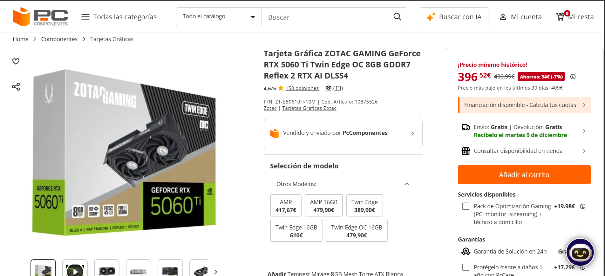
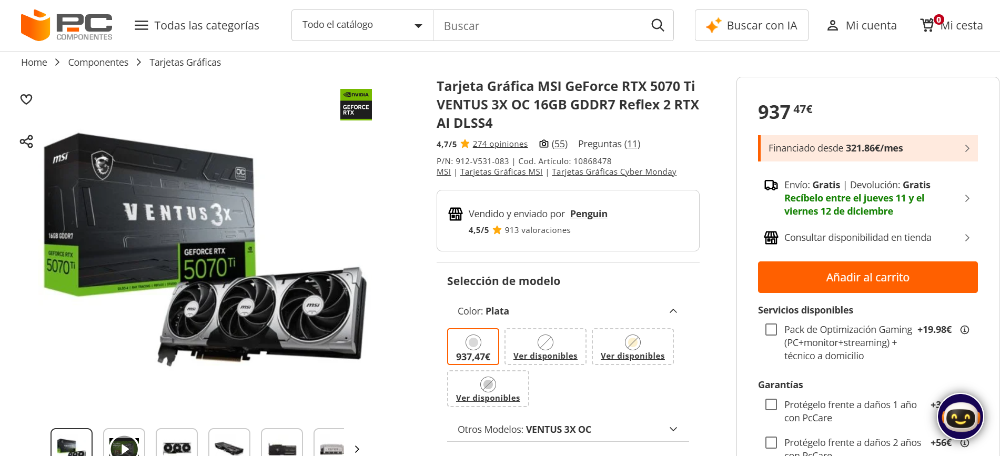
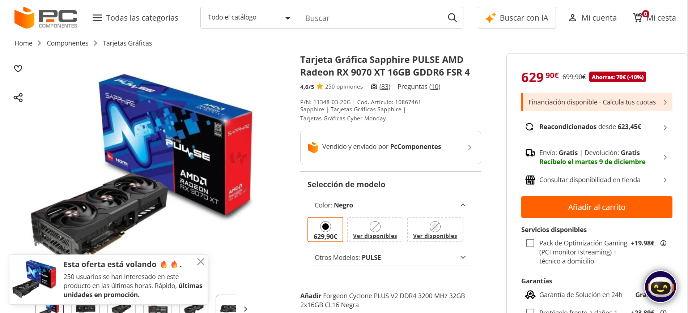

# Parte 3 — GPUs y precios reales (Black Friday 2025)
> Vídeo: **“Mejores Tarjetas Gráficas Calidad - Precio | TOP GPUs GAMING Black Friday 2025”**  
> URL: https://www.youtube.com/watch?v=ILOtkTXLUvg

## 1) Introducción (5–10 líneas)
En el video se dan recomendaciones sobre gráficas recomendadas según diferentes tramnos de precios, en esta parte del reto, vamos a compararlas entre ellas, teniendo en cuenta diiferentes factores (precio,especificaciones...) .

## 2) Tramos del vídeo y modelos mencionados
### 2.1 Tramo ~350 €
- Minuto inicio–fin: **04:46 – 07:43**
- GPUs citadas (2): **PowerColor Reaper AMD Radeon RX 9060 XT 16GB GDDR6** y **ZOTAC GAMING GeForce RTX 5060 Ti Twin Edge OC 8GB GDDR7**

### 2.2 Tramo 600–800 €
- Minuto inicio–fin: **11:36 – 14:05**
- GPUs citadas (2): **MSI GeForce RTX 5070 Ti VENTUS 3X OC 16GB GDDR7** y **Sapphire PULSE AMD Radeon RX 9070 XT 16GB GDDR6**

**¿Se repite algún modelo entre tramos?**
No, pero en el tramo de los 600-800€ se recomiendan las siguiente graficas en la gama de AMD y GeForce de las anteriores recomendadas(modelo A y B), que son la RX 9070 XT con GDDR6 para AMD y la GeForce RTX 5070 Ti con GDDR7 para GeForce, ambas con 16gb. 

### 3.1 GPU del tramo 350 € — Modelo A
- Tienda: PcComponentes
- Nombre exacto en tienda:Tarjeta Gráfica PowerColor Reaper AMD Radeon RX 9060 XT 16GB GDDR6 FSR 4
- Precio (€):405,36
- URL: https://www.pccomponentes.com/tarjeta-grafica-powercolor-reaper-amd-radeon-rx-9060-xt-16gb-gddr6-fsr-4
- Imagen: 

### 3.2 GPU del tramo 350 € — Modelo B
- Tienda:PcComponentes
- Nombre exacto en tienda:Tarjeta Gráfica ZOTAC GAMING GeForce RTX 5060 Ti Twin Edge OC 8GB GDDR7 Reflex 2 RTX AI DLSS4
- Precio (€):396,52
- URL: https://www.pccomponentes.com/tarjeta-grafica-zotac-gaming-geforce-rtx-5060-ti-twin-edge-oc-8gb-gddr7-reflex-2-rtx-ai-dlss4
- Imagen: 

### 3.3 GPU del tramo 600–800 € — Modelo C
- Tienda:PcComponentes
- Nombre exacto en tienda:Tarjeta Gráfica MSI GeForce RTX 5070 Ti VENTUS 3X OC 16GB GDDR7 Reflex 2 RTX AI DLSS4
- Precio (€):937,47
- URL: https://www.pccomponentes.com/tarjeta-grafica-msi-geforce-rtx-5070-ti-ventus-3x-oc-16gb-gddr7-reflex-2-rtx-ai-dlss4
- Imagen: 

### 3.4 GPU del tramo 600–800 € — Modelo D
- Tienda:PcComponentes
- Nombre exacto en tienda:Tarjeta Gráfica Sapphire PULSE AMD Radeon RX 9070 XT 16GB GDDR6 FSR 4
- Precio (€):629,90
- URL: https://www.pccomponentes.com/tarjeta-grafica-sapphire-pulse-amd-radeon-rx-9070-xt-16gb-gddr6-fsr-4
- Imagen: 

## 4) Tabla comparativa (precios reales)
| Tramo (vídeo) | GPU (modelo del vídeo) | Tienda | Precio (€) | URL | Imagen |
|---|---|---|---:|---|---|
| 350 € | PowerColor Reaper AMD Radeon RX 9060 XT 16GB GDDR6  |PcComponentes|405,36|https://www.pccomponentes.com/tarjeta-grafica-powercolor-reaper-amd-radeon-rx-9060-xt-16gb-gddr6-fsr-4||
| 350 € | ZOTAC GAMING GeForce RTX 5060 Ti Twin Edge OC 8GB GDDR7 |PcComponentes|396,52|https://www.pccomponentes.com/tarjeta-grafica-zotac-gaming-geforce-rtx-5060-ti-twin-edge-oc-8gb-gddr7-reflex-2-rtx-ai-dlss4||
| 600–800 € | MSI GeForce RTX 5070 Ti VENTUS 3X OC 16GB GDDR7 |PcComponentes|937,47|https://www.pccomponentes.com/tarjeta-grafica-msi-geforce-rtx-5070-ti-ventus-3x-oc-16gb-gddr7-reflex-2-rtx-ai-dlss4||
| 600–800 € | Sapphire PULSE AMD Radeon RX 9070 XT 16GB GDDR6 |PcComponentes|629,90|https://www.pccomponentes.com/tarjeta-grafica-sapphire-pulse-amd-radeon-rx-9070-xt-16gb-gddr6-fsr-4||

**Imágenes:**

## 5) Conclusión (5–8 líneas)
- **¿Los precios reales se parecen a lo que sugiere el vídeo?**

En PcComponentes, son más caras respecto a los precios que se dan en el video, pero pueden haber cambios en los precios durante el periodo del BlackFriday y que los precios acaben siendo más similares a los mencionados, por otra parte, no he buscado los modelos en otras tiendas, pero seguramente puedas encontrar un precio algo más competitivo si buscas en diferentes tiendas de componentes. 
- ¿Cuál de las cuatro ofrece mejor **calidad-precio** y por qué?
Para el **primer tramo de precios** y basándome solo en los precios de PcComponentes, la mejor en relacion calidad precio es la **5060 Ti de GeForce** que aunque ofrece unas especificaciones bastante similares a la de AMD, dispone de las tecnologías de NVIDIA como el DLSS y la generacion de frames con IA para videojuegos que en la version de 8GB es bastante diferencial a la hora del gaming.

En el **segundo tramo de precios** de nuevo basandome solo en los precios ofrecidos en PcComponentes, la mejor relacion calidad precio es para la **AMD RX 9070 XT** de 16GB, que aunque tiene GDDR6 en puesto del GDDR7 de la GeForce,  su precio es casi 300€ menor y la tecnología FSR4 es bastante similar a DLSS de NVIDIA, aportando grandes resultados también en el area del gaming. 

- **Observaciones finales.**

Si nuestro presupuesto está más cercano al primer tramo del video (entre 350-400€) nuestra mejor opción será la **5060 Ti** sin embargo si nuestro presupuesto es mayor (entre 600-800) podemos decir que la mejor calidad precio será para la **9070 XT** 

## 6) Fuentes
- Tiendas: PcComponentes:
  
  https://www.pccomponentes.com/tarjeta-grafica-powercolor-reaper-amd-radeon-rx-9060-xt-16gb-gddr6-fsr-4
  https://www.pccomponentes.com/tarjeta-grafica-zotac-gaming-geforce-rtx-5060-ti-twin-edge-oc-8gb-gddr7-reflex-2-rtx-ai-dlss4
  https://www.pccomponentes.com/tarjeta-grafica-msi-geforce-rtx-5070-ti-ventus-3x-oc-16gb-gddr7-reflex-2-rtx-ai-dlss4
  https://www.pccomponentes.com/tarjeta-grafica-sapphire-pulse-amd-radeon-rx-9070-xt-16gb-gddr6-fsr-4
  
- Vídeo: [URL al inicio del documento.](https://www.youtube.com/watch?v=ILOtkTXLUvg)
